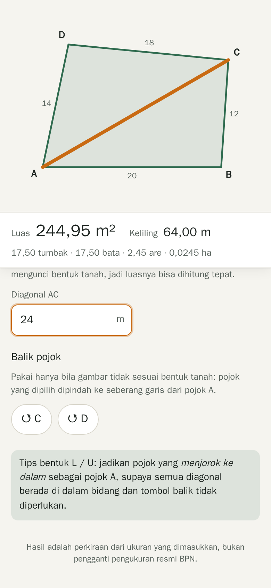
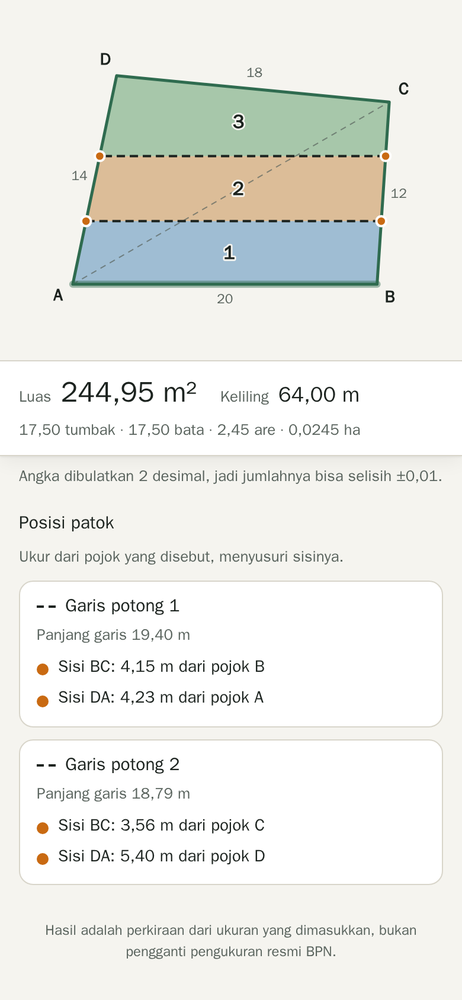
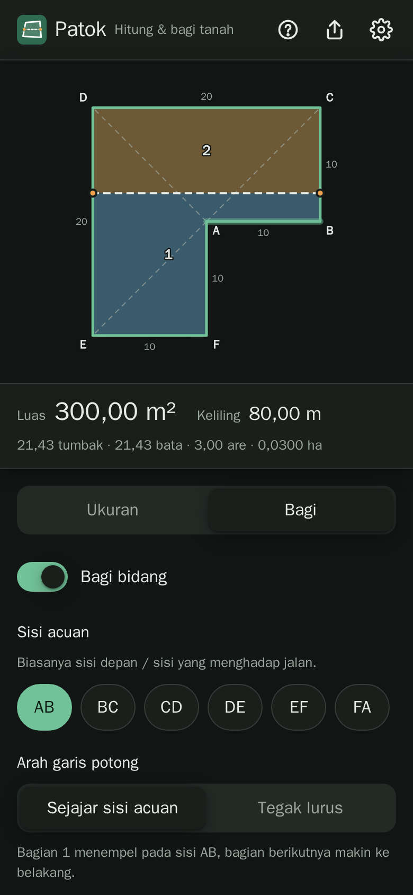
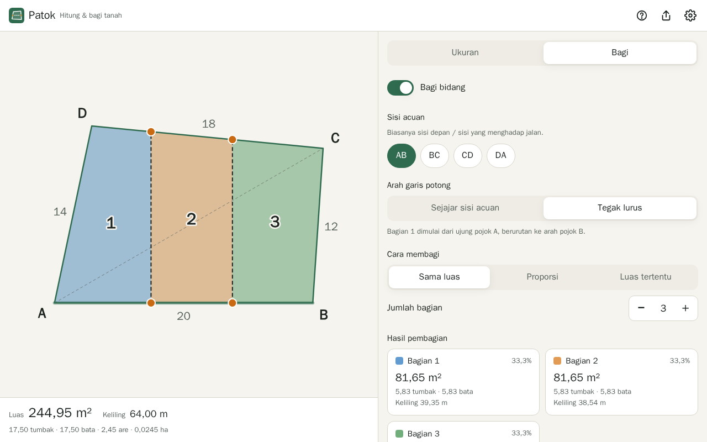

# Patok — Hitung & Bagi Tanah

Web app sederhana untuk **menghitung luas dan keliling sebidang tanah** dari ukuran meteran, lalu **membaginya menjadi beberapa bagian** lengkap dengan **posisi patok** di lapangan. Dibuat untuk orang awam, nyaman di HP, dan tetap jalan **tanpa sinyal**.

<p align="center">
  
  
  
</p>

<p align="center">
  
</p>

## Fitur

- **Bentuk bebas 3–10 sisi**, termasuk tanah cekung seperti bentuk L atau U.
- **Cukup pakai meteran.** Bentuk tanah dikunci dari panjang sisi dan diagonal dari satu pojok, tanpa perlu alat ukur sudut.
- **Luas dalam m², are, ha, tumbak, dan bata.** Nilai tumbak/bata bisa diatur karena berbeda antar daerah (default 14 m²).
- **Bagi bidang** sejajar atau tegak lurus terhadap sisi acuan (mis. sisi depan/jalan), dengan tiga cara:
  - sama luas (2–10 bagian)
  - proporsi, mis. 2 : 1 : 1
  - luas tertentu + sisa, mis. 100 m² + sisanya
- **Posisi patok.** Untuk setiap garis potong ditampilkan sisi yang terpotong dan jaraknya dari pojok terdekat, misalnya *"Sisi BC: 4,15 m dari pojok B"*.
- **Validasi yang jelas.** Ukuran yang mustahil ditandai merah beserta segitiga yang bermasalah. Salah baca meteran yang kecil (≤ 0,5%) hanya memunculkan peringatan.
- **Simpan otomatis** di perangkat dan **bagikan lewat link** (mis. ke WhatsApp). Data ada di hash URL, jadi tidak pernah dikirim ke server.
- **PWA**: bisa diinstal ke layar utama dan dipakai offline.
- Mendukung mode gelap, mudah dipakai dengan pembaca layar, dan setiap target sentuh minimal 44 px.

> Hasil hitungan adalah **perkiraan** dari ukuran yang dimasukkan, bukan pengganti pengukuran resmi BPN atau juru ukur berlisensi.

## Cara pakai singkat

1. Beri nama pojok tanah **A, B, C, …** berurutan mengelilingi tanah.
2. Isi **panjang setiap sisi** (AB, BC, …) dan **diagonal dari pojok A** (AC, AD, …).
3. Cek gambar. Luas dan keliling langsung muncul.
4. Buka tab **Bagi** → pilih sisi acuan, arah, dan cara membagi → baca **Posisi patok**.

Panduan lengkap, termasuk tips mengukur di lapangan, ada di **[docs/panduan-pengguna.md](docs/panduan-pengguna.md)**.

## Menjalankan secara lokal

Butuh **Node.js 20+**.

```bash
npm install
npm run dev          # buka http://localhost:5173
```

| Perintah | Fungsi |
|---|---|
| `npm run dev` | Server pengembangan dengan hot reload |
| `npm run build` | Build produksi ke `dist/` (termasuk service worker) |
| `npm run preview` | Menjalankan hasil build secara lokal |
| `npm test` | Unit test & property test (Vitest) |
| `npm run test:e2e` | Uji end-to-end di viewport HP (Playwright). Pertama kali: `npx playwright install chromium` |
| `npm run check` | Type-check Svelte + TypeScript |
| `npm run icons` | Membuat ulang ikon PWA dari `public/logo.svg` |

## Deploy

Hasil `npm run build` adalah folder statis `dist/` yang bisa di-host di mana saja.

**GitHub Pages (otomatis).** Repo ini sudah menyertakan workflow [`.github/workflows/deploy.yml`](.github/workflows/deploy.yml):

1. Push ke GitHub.
2. Buka **Settings → Pages → Build and deployment → Source: GitHub Actions**.
3. Setiap push ke branch `main` akan menjalankan tes lalu men-deploy ke `https://<username>.github.io/<nama-repo>/`.

**Hosting lain** (Netlify, Cloudflare Pages, nginx, …): jalankan `npm run build` lalu unggah isi `dist/`. Kalau aplikasi dipasang di sub-folder, set base path saat build:

```bash
BASE_PATH=/patok-tanah/ npm run build
```

## Struktur proyek

```
src/
  geometry/        Inti hitungan murni (tanpa UI), seluruhnya diuji
    build.ts       sisi + diagonal + balik → koordinat pojok, validasi
    measure.ts     luas (shoelace), keliling, cek sisi bersilangan, konversi satuan
    clip.ts        potong poligon dengan setengah-bidang
    split.ts       target luas → posisi garis potong (bisection) → bagian & patok
  state/
    model.ts       model data, ubah jumlah sisi, hitung semua, validasi data luar
    persist.ts     simpan/muat localStorage
    share.ts       encode/decode link bagikan
    app.svelte.ts  state reaktif bersama (Svelte 5 runes)
  ui/              Komponen Svelte (gambar SVG, form, panel bagi, dialog)
  App.svelte       Layout, alur muat/simpan/bagikan, PWA
e2e/               Uji end-to-end Playwright
docs/              Desain, rencana implementasi, panduan pengguna
```

Penjelasan cara kerja geometri dan semua keputusan desain ada di **[docs/design.md](docs/design.md)**.

## Teknologi

[Svelte 5](https://svelte.dev) · TypeScript · [Vite](https://vite.dev) · [vite-plugin-pwa](https://vite-pwa-org.netlify.app) · [Vitest](https://vitest.dev) + [fast-check](https://fast-check.dev) · [Playwright](https://playwright.dev)

Tidak ada backend, database, analitik, atau font/skrip dari pihak ketiga.

## Kontribusi

Laporan bug dan usulan sangat diterima. Lihat [CONTRIBUTING.md](CONTRIBUTING.md).
